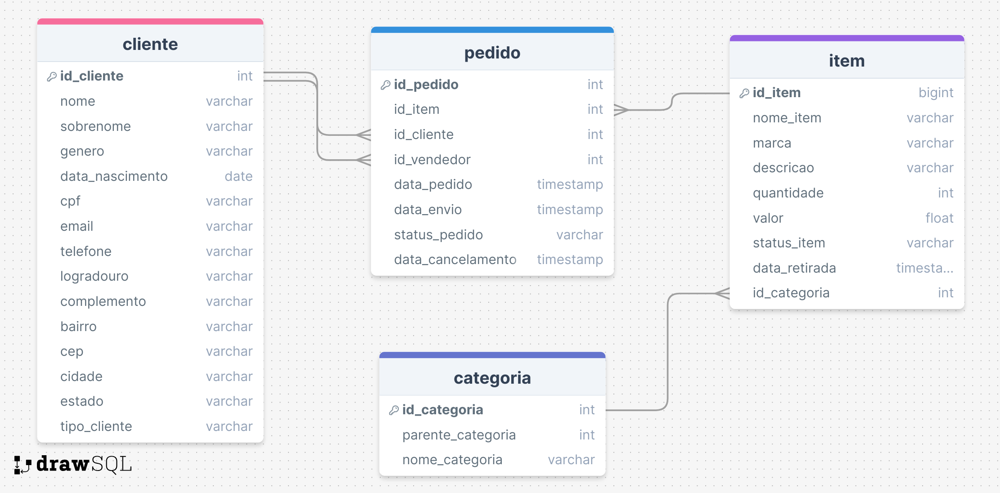

# Challenge Mercado Livre

## Visao Geral

Este projeto é um teste técnico para uma posição no Mercado Livre. O desafio é divido em três partes, avaliando habilidades de `Analytics`, `SQL` e `Python`.

## Sumário

- [Analytics](#analytics)

- [SQL](#sql)

- [Python](#python)

## Analytics

## SQL

### Objetivo

A partir da seguinte necessidade, é requerido projetar um DER (Diagrama Entidade-Relacionamento) que responda ao modelo de negócios. Em seguida, diferentes perguntas devem ser respondidas usando SQL.

### Descrição da necessidade

Levando em conta o modelo de e-commerce que gerenciamos, temos algumas entidades básicas que queremos representar: Cliente, Pedido, Item e Categoria.

**Cliente**: É a entidade onde estão localizados todos os nossos usuários, sejam eles Compradores ou Vendedores do Site. Os principais atributos são email, nome, sobrenome, sexo, endereço, data de nascimento, telefone, entre outros.

**Item**: É a entidade onde os produtos publicados em nosso marketplace estão localizados. O volume é muito grande devido ao fato de que todos os produtos que foram publicados em algum momento estão presentes. Por meio do status do item ou da data de retirada, é possível detectar os itens ativos do marketplace.

**Categoria**: É a entidade onde está a descrição de cada categoria com seu respectivo caminho. Cada item tem uma categoria associada a ele.

**Pedido**: O pedido é a entidade que reflete as transações geradas dentro do site (cada compra é um pedido). Nesse caso, não teremos um fluxo de carrinho de compras, portanto, cada item que for vendido será refletido em um pedido, independentemente da quantidade que tenha sido comprada.

### Diagrama Entidade Relacionamento



### Scripts

Os scripts de criação de tabelas se encontram em `sql\create_tables.sql`.

Abaixo, se encontra os scripts que correspondem três perguntas dada a modelagem:

```sql
-- Sintaxe baseada no PostgreSQL
/*
Listar os usuários que fazem aniversário hoje e que realizaram mais de 1500 vendas em janeiro de 2020.
*/
SELECT 
    b.id_cliente, 
    b.nome, 
    b.sobrenome, 
    b.data_nascimento, 
    COUNT(a.id_pedido) AS qtd_vendas
FROM pedido AS a
INNER JOIN cliente AS b
    ON a.id_vendedor = b.id_cliente
WHERE b.data_nascimento = CURRENT_DATE
AND MONTH(a.data_pedido) = 1
AND YEAR(a.data_pedido) = 2020
GROUP BY b.id_cliente, b.nome, b.sobrenome, b.data_nascimento
HAVING COUNT(a.id_pedido) > 1500

/*
Para cada mês de 2020, solicitar o top 5 usuários que mais venderam ($) na categoria Celulares. 
Requer-se o mês e ano de análise, nome e sobrenome do vendedor, quantidade de vendas realizadas, 
quantidade de produtos vendidos e o montante total transacionado.
*/

WITH vendasMes AS (
    SELECT
        d.nome_categoria,
        YEAR(a.data_pedido) AS ano_pedido,
        MONTH(a.data_pedido) AS mes_pedido,
        b.id_cliente,
        b.nome,
        b.sobrenome,
        COUNT(a.id_pedido) AS qtd_vendas,
        COUNT(DISTINCT a.id_item) AS qtd_itens_distintos,
        SUM(c.valor) AS total_transacionado,
        ROW_NUMBER() OVER (PARTITION BY YEAR(a.data_venda), MONTH(a.data_venda) ORDER BY SUM(c.valor_total) DESC) AS posicao
    FROM pedido AS a
    INNER JOIN cliente AS b
        ON a.id_vendedor = b.id_cliente
    INNER JOIN item AS c
        ON a.id_item = c.id_item
    INNER JOIN categoria AS d
        ON c.id_categoria = d.id_categoria
    WHERE YEAR(a.data_pedido) = 2020
    and d.nome_categoria = 'Celulares'
)
SELECT 
    nome_categoria,
    ano_pedido,
    mes_pedido,
    id_cliente,
    nome,
    sobrenome,
    qtd_vendas,
    qtd_itens_distintos,
    total_transacionado
FROM vendasMes
WHERE posicao <= 5;


/*
Solicita-se popular uma nova tabela com o preço e estado dos itens no final do dia. 
Deve ser reprocesável e ter apenas o último estado informado com a chave primária definida.
*/

CREATE PROCEDURE estado_itens_atual AS
BEGIN
    -- limpa tabela atual de itens
    TRUNCATE TABLE item_atual;

    -- insere o ultimo estado dos itens
    INSERT INTO item_atual 
    (
        id_item,
        nome_item,
        marca,
        descricao,
        quantidade,
        valor,
        status_item,
        data_retirada,
        categoria_id
        )
    SELECT
        i.id_item,
        i.nome_item,
        i.marca,
        i.descricao,
        i.quantidade,
        i.valor,
        i.status_item,
        i.data_retirada,
        i.categoria_id
    FROM (
        SELECT 
            id_item,
            MAX(data_hora_atualizacao) AS data_hora_atualizacao
        FROM item
        GROUP BY id_item
    ) AS ultima_att
    INNER JOIN item AS i
        ON i.item_id = ultima_att.id_item
        AND i.data_hora_atualizacao = ultima_att.data_hora_atualizacao;

END;
```


## Python

### Objetivo

Analisar ofertas de buscas distintas de produtos no site do [Mercado Livre](https://mercadolivre.com.br) utilizando a linguagem python e as bibliotecas necessárias.

### Instalação

1. Clone o repositório:

```shell
git clone https://github.com/seu-usuario/ml-challenge.git
cd ml-challenge
```

2. Crie e ative um ambiente virtual:

```shell
python3 -m venv env
source env/bin/activate  # No Windows: env\Scripts\activate
```

3. Instale as dependências:

```shell
pip install -r requirements.txt
```

### Dependências

As dependências estão listadas no arquivo `requirements.txt`:

```
requests
pyspark
pandas
```

### Uso

Para executar o código, use o seguinte comando:

```shell
python3 python/main.py
```

### Descrição dos Arquivos

`requirements.txt`

Lista as bibliotecas necessárias para o projeto.

```
requests==2.32.3
pyspark==3.5.1
pandas==2.2.2
```

`config.ini`

Configurações do projeto.

```ini
[endpoints]
search_item = https://api.mercadolibre.com/sites/MLB/search?
item_detail = https://api.mercadolibre.com/items/
```

`README.md`

O arquivo que você está lendo, contendo a documentação do projeto.

`definitions.py`

Contém as constantes utilizadas no projeto.

`utils.py`

Contém funções utilitárias para o projeto.

```python
def write_json(json_var: dict, file_name: str, mode: str) -> None:
    """
    Escreve um arquivo .json no diretório especificado.

    Argumentos: \n
    json_var - varivel do json, deve ser um dict \n
    file_name - diretorio do arquivo .json, deve ser uma string \n
    mode - modo de escrita do arquivo, deve ser uma string \n
    """
    try:
        JSON_PATH = os.path.join(definitions.ROOT_DIR, 'data', f'{file_name}.json')

        with open(JSON_PATH, mode, encoding='utf-8') as file:
            json.dump(json_var, file, ensure_ascii=False, indent=4)

    except Exception as e:
        print('Error:', e)
```

### Diagrama da Solução

![title][](.\assets\ml-challenge.png)

### Solução

A solução foi dividida em três partes:

1. Varrer uma lista de mais de 150 itens ids na API publica do Mercado Livre: 
   
   Exemplo de chamada HTTPS: 
   
   <https://api.mercadolibre.com/sites/MLA/search?q=chromecast&limit=50#json>
   
   A função `search_item` do arquivo `call_api.py` irá realizar a busca passando os seguintes parâmetros:
   
   ```json
   [
       {
           "q": "chevrolet onix 1.0 turbo 2022",
           "category": "MLB1744",
           "limit": 50
       },
       {
           "q": "hyundai hb20 1.0 turbo 2022",
           "category": "MLB1744",
           "limit": 50
       },
       {
           "q": "volkswagen polo 1.0 turbo 2022",
           "category": "MLB1744",
           "limit": 50
       }
   ]
   ```
   
   ```python
   def search_item(params:dict) -> list:
       """
       Retorna o response do endpoint de busca de itens.
   
       Argumentos: \n
       params - parametros de consulta, deve ser um dict
       """
       try:
           response = requests.get(
               url=config['endpoints']['search_item'],
               params=params
           )
   
           if response.status_code == 200:
               return response.json()
   
       except requests.exceptions.RequestException as e:
           print('Error:', e)
           return None
   ```
   
   A função acima é executada pelo seguinte código na função `get_item_data`:
   
   ```python
   # lê os parametros definidos no arquivo params.json
   params = read_parameters()
   
   # percorre os paramentos a serem consultados e realiza o metodo get no endpoint de busca
   for key, param in enumerate(params):
       response = search_item(params=param)
   
       if key == 0:
           search_results:list = response['results']
       else:
           for result in response['results']:
               search_results.append(result)
   ```

2. Para cada item_id obtido no passo anterior, realizar um método HTTP "GET " no endpoint:
   
   <https://api.mercadolibre.com/items/{Item_Id}>
   
   A função a seguir realiza uma chamada na API e obtém com retorno um JSON com o detalhamento do item.
   
   ```python
   def get_item_detail(id_item:str) -> dict:
       """
       Retorna o response do endpoint de itens.
   
       Argumentos: \n
       id_item - id do item, deve ser uma string
       """
       try:
           response = requests.get(
               url=f"{config['endpoints']['item_detail']}/{id_item}"
           )
   
           if response.status_code == 200:
               response = response.json()
               return response
   
       except requests.exceptions.RequestException as e:
           print('Error:', e)
           return None
   ```
   
   A função acima é executada pelo seguinte código na função `get_item_data` e em seguida um arquivo chamado items.json é escrito no diretório ./data:
   
   ```python
   # varre os resultados do endpoint de busca e realiza o metodo get no endpoint de item
   items_list: list = []
   for key, result in enumerate(search_results):
       items:dict = get_item_detail(result['id'])
       items_list.append(items)
   
   write_json(items_list, 'items', 'w+')
   ```

3. Escrever o resultado em um arquivo .csv (Comma-separated values) desnormalizando o JSON obtido no passo anterior.
   
   O arquivo `elt_items.py` realiza o processo de ETL (Extract, Transform and Load) do arquivo items.json desnormalizando e tratados os dados obtidos.
   
   A função `etl_items_pyspark` realiza a tarefa citada.
   
   ```python
   def etl_items_spark():
       """
       ETL em PySpark do arquivo items.json.
       """
       try:
           spark = (
               SparkSession
               .builder
               .appName("etl_items")
               .getOrCreate()
           )
           # arquivo json de items
           json_file_path = definitions.ITEMS_JSON_PATH
           df_items = spark.read.json(json_file_path, multiLine=True)
   
           atributes = ['BRAND','COLOR','FIPE_PRICE','KILOMETERS','ENGINE','MODEL','VEHICLE_YEAR','TRANSMISSION']
   
           df_items_tratado = (
               df_items
               .select(
                   F.col('id'),
                   F.col('site_id'),
                   F.col('title'),
                   F.col('category_id'),
                   F.coalesce(F.col('price'), F.lit(0)).cast(FloatType()).alias('price'),
                   F.coalesce(F.col('base_price'), F.lit(0)).cast(FloatType()).alias('base_price'),
                   F.coalesce(F.col('original_price'), F.lit(0)).cast(FloatType()).alias('original_price'),
                   F.col('location.city.name').alias('city_name'),
                   F.col('location.state.name').alias('state_name'),
                   F.col('location.country.name').alias('country_name'),
                   F.explode(F.col('attributes')).alias('attributes_exploded')
               )
               .withColumn('attribute_id', F.col('attributes_exploded.id'))
               .withColumn('attribute_name', F.col('attributes_exploded.name'))
               .withColumn('attribute_value', F.col('attributes_exploded.value_name'))
               .drop('attributes_exploded')
               .filter(F.col('attributes_exploded.id').isin(atributes))
           )
   
           df_items_pivoted = (
               df_items_tratado
               .withColumn('attribute_id', F.lower(F.col('attribute_id')))
               .groupBy(
                   F.col('id'),
                   F.col('site_id'),
                   F.col('title'),
                   F.col('category_id'),
                   F.col('price'),
                   F.col('base_price'),
                   F.col('original_price'),
                   F.col('city_name'),
                   F.col('state_name'),
                   F.col('country_name'),
               )
               .pivot('attribute_id')
               .agg(F.first('attribute_value'))
           )
   
           df_items_final = (
               df_items_pivoted
               .withColumn('fipe_price', F.regexp_replace('fipe_price', 'r\$', ''))
               .withColumn('fipe_price', F.regexp_replace('fipe_price', '\.', ''))
               .withColumn('fipe_price', F.regexp_replace('fipe_price', ',', '.'))
               .withColumn('fipe_price', F.trim('fipe_price').cast(FloatType()))
               .withColumn('fipe_price', F.coalesce('fipe_price', F.lit(0)))
               .withColumn('kilometers', F.trim(F.regexp_replace('kilometers', 'km', '')).cast(FloatType()))
               .withColumn('transmission_type', 
                           F.when(F.col('transmission').like('Automática%'), F.lit('Automática'))
                           .when(F.col('transmission').like('Manual%'), F.lit('Manual'))
                           .otherwise(F.col('transmission'))
               )
           )
   
           df_items_final = df_items_final.toPandas()
   
           df_items_final.to_csv(definitions.ITEMS_CSV_PATH)
   
           spark.stop()
   
       except Exception as e:
           print('ETL Error:', e)
   ```

### Análise Exploratória

A análise compara os valores de três modelos de carros populares do ano de 2022, sendo: Chevrolet Onix, Volkswagen Polo e Hyundai HB20. Os dados foram obtidos a partir de APIs do Mercado Livre.

Toda a análise está diponivél em `python\notebook\analise_exploratoria.ipynb`.
